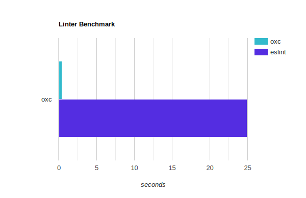

# Benchmark for Oxc vs ESLint

This benchmark only compares with ESLint and does not compare against [Biome](https://biomejs.dev) because the rules do not match.

## Summary

Oxlint is 50x - 100x faster than ESLint depending on the number of CPU cores.

## Input

* uses the `vscode/src` directory, which contains 3684 files to lint
* See .eslintrc.json for ESLint configuration.
* @typescript-eslint is required for TypeScript

## Results

### Mac M2 8 cores

58 times faster than ESLint.



```
Benchmark 1: oxc
  Time (mean ± σ):     424.0 ms ±   2.2 ms    [User: 2243.9 ms, System: 373.6 ms]
  Range (min … max):   420.9 ms … 427.0 ms    10 runs

Benchmark 2: eslint
  Time (mean ± σ):     24.904 s ±  0.624 s    [User: 40.804 s, System: 1.691 s]
  Range (min … max):   24.292 s … 26.469 s    10 runs

Summary
  'oxc' ran
   58.73 ± 1.50 times faster than 'eslint'
```

## Intel i7 6-cores

```
Benchmark 1: oxc
  Time (mean ± σ):     366.6 ms ±  16.8 ms    [User: 3116.9 ms, System: 507.3 ms]
  Range (min … max):   343.6 ms … 399.8 ms    10 runs

Benchmark 2: eslint
  Time (mean ± σ):     50.486 s ±  1.975 s    [User: 82.670 s, System: 3.590 s]
  Range (min … max):   47.101 s … 54.417 s    10 runs

Summary
  'oxc' ran
  137.70 ± 8.28 times faster than 'eslint'
```

## AMD 5800H 8-cores

```
Benchmark 1: oxc
  Time (mean ± σ):     239.6 ms ±   2.3 ms    [User: 3113.7 ms, System: 153.3 ms]
  Range (min … max):   236.8 ms … 244.1 ms    10 runs

Benchmark 2: eslint
  Time (mean ± σ):      16.318 s ±  0.566 s   [User: 16.324 s, System: 0.723 s]
  Range (min … max):    15.624 s … 16.965 s   10 runs

Summary
  oxc ran
   68.09 ± 2.45 times faster than eslint
```

## 13th Gen Intel(R) i9-13980HX 24-cores (8p / 16e)
```
Benchmark 1: oxc
  Time (mean ± σ):      28.7 ms ±   3.0 ms    [User: 13.3 ms, System: 20.6 ms]
  Range (min … max):    23.1 ms …  44.3 ms    119 runs

Benchmark 2: eslint
  Time (mean ± σ):     374.9 ms ±   3.9 ms    [User: 416.3 ms, System: 67.2 ms]
  Range (min … max):   367.6 ms … 382.5 ms    10 runs

Summary
  'oxc' ran
   13.07 ± 1.38 times faster than 'eslint'
```

## Intel core i5-4590

```
Benchmark 1: oxc
  Time (mean ± σ):      1.197 s ±  0.065 s    [User: 3.590 s, System: 0.273 s]
  Range (min … max):    1.147 s …  1.314 s    10 runs

  Warning: Ignoring non-zero exit code.

Benchmark 2: eslint
  Time (mean ± σ):     82.076 s ±  5.129 s    [User: 126.155 s, System: 3.591 s]
  Range (min … max):   77.457 s … 91.170 s    10 runs

Summary
  'oxc' ran
   71.68 ± 4.81 times faster than 'eslint'
```

## Run

```bash
./init.sh
./bench.sh
```
